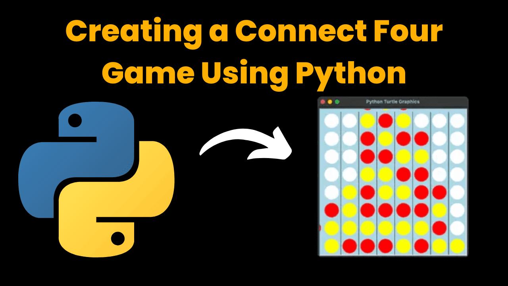

# Connect 4

This is a **Python-based console game** implementing the classic **Connect 4**. The game is structured using a **modular file organization**, making it easy to expand and maintain.

## Features:
- **Two-player turn-based gameplay**
- **Victory and draw tracking** (planned for future updates)
- **Modular code structure** with separate files for game logic, board display, and utilities
- **Expandable game settings** – potential future updates include:
  - Saving wins and draws in text files
  - Support for up to **4 players**
  - Customizable board size (more rows and columns)
  - GUI integration using **Tkinter**
  - JavaScript-based front-end for web compatibility

This project is a great learning experience for **Python development, structured programming, and future UI/UX improvements**.
